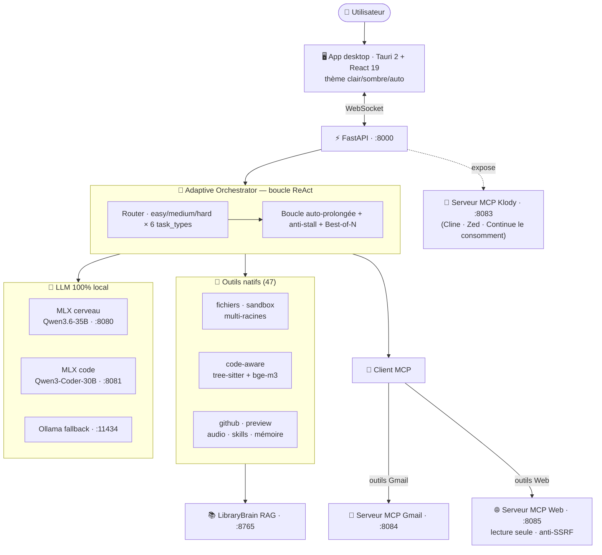

<div align="center">

# 🧠 Klody Code AI

### Un agent de code **100 % local** — privé, sécurisé, extensible — qui rivalise avec un agent cloud sur une machine perso.

Pas d'API cloud. Aucune donnée ne quitte la machine. Le cerveau (MLX/Apple Silicon),
les outils, la mémoire, le RAG, **et** les connecteurs (Gmail, web, MCP) tournent en local.


[Étude de cas technique](docs/CASE-STUDY.md) · [Architecture](#architecture) · [Sécurité](#sécurité) · [Pour les entreprises](docs/CONSULTING.md)

</div>

> **Status** : v2.1+ stable · **699 tests** · CI à gates (bandit / gitleaks / pip-audit / coverage) · cerveau MLX `Qwen3.6-35B-A3B` · client **et** serveur MCP

<!-- 📸 À AJOUTER : une capture (thème sombre conseillé) + un GIF de démo 20-30s dans docs/assets/,
     puis DÉ-COMMENTER la ligne ci-dessous (laissée commentée pour ne pas afficher d'image cassée) :
<p align="center"></p>
-->

---

## Pourquoi c'est intéressant

La plupart des agents de code envoient ton code et tes données dans le cloud. **Klody fait
l'inverse** : tout s'exécute sur ta machine. Le défi technique — faire d'un modèle local
(plus petit que la frontière) un agent fiable — est résolu par l'**orchestration**, pas par
la force brute : un routeur adaptatif, une boucle ReAct qui va au bout, un sandbox isolé, et
une discipline de tests/sécurité de niveau production. Le tout extensible via **MCP** : Klody
**consomme** des serveurs externes (Gmail, web…) *et* **s'expose** comme serveur pour d'autres agents.

| | |
|---|---|
| 🔒 **Privé par conception** | 100 % local. Sandbox fichiers multi-racines, fichiers sensibles bloqués partout, anti-SSRF sur le web, commits signés. |
| 🧭 **Orchestration, pas brute force** | Routeur (easy/medium/hard × 6 types de tâches, F1≈0,85), boucle auto-prolongée, Best-of-N conditionnel, anti-stall. |
| 🔌 **Extensible via MCP** | Client MCP (consomme Gmail, web, n'importe quel serveur) + serveur MCP (Cline/Zed/Continue consomment Klody). |
| 🧰 **Complet** | 47 outils, app desktop (Tauri/React, thème clair/sombre/auto), mémoire long terme, RAG livres, retrieval code-aware. |
| ✅ **Production-grade** | 699 tests, coverage 78 %, CI 5 jobs (sécurité + régression + contrat), branch protection + signed commits. |

## Architecture



## Caractéristiques clés

| # | Feature | Détail |
|---|---|---|
| 1 | **100 % local & privé** | MLX sur Apple Silicon (`Qwen3.6-35B-A3B` cerveau, `Qwen3-Coder-30B` code). Zéro appel cloud par défaut. |
| 2 | **Routeur adaptatif** | classifie chaque prompt → 3 difficultés × 6 task_types → budget d'itérations + planner + Best-of-N (F1≈0,85). |
| 3 | **Boucle qui va au bout** | auto-continue quand la tâche est actionnable ; cliquet de continuation ("ok/vas-y" réutilise le routage). |
| 4 | **Sandbox isolé multi-racines** | venv jetable par racine, `ALLOWED_ROOTS`, exec auto après write (`py_compile`/`pytest`). |
| 5 | **Client MCP** | consomme n'importe quel serveur MCP ; outils exposés au LLM sous `mcp__<srv>__<outil>`. |
| 6 | **Serveurs MCP fournis** | Gmail (IMAP/SMTP) + Web (fetch/search **lecture seule**, anti-SSRF) — branchés par une ligne de `.env`. |
| 7 | **Serveur MCP Klody** | Klody = plateforme pour d'autres agents (Cline, Zed, Continue.dev). |
| 8 | **Retrieval code-aware** | tree-sitter (symboles/refs) + embeddings bge-m3 (`find_symbol`, `find_relevant_files`). |
| 9 | **Best-of-N + mémoire** | N candidats T variés + action override ; conventions auto-détectées + mémoire d'erreurs. |

## Stack technique

| Composant | Tech |
|-----------|------|
| Runtime | Python 3.11+ · FastAPI · WebSocket |
| LLM cerveau | **MLX-LM** — `unsloth/Qwen3.6-35B-A3B-MLX-8bit` (`:8080`, `enable_thinking=false`) |
| LLM code | **MLX-LM** — `mlx-community/Qwen3-Coder-30B-A3B-Instruct-8bit` (`:8081`) |
| LLM fallback | **Ollama** — `qwen2.5-coder:32b` (`:11434`) |
| Embeddings | **Ollama** — `bge-m3` |
| RAG livres | **LibraryBrain** — sqlite-vec + FTS5 (`:8765`) |
| MCP | **FastMCP** — Klody client *et* serveur ; connecteurs Gmail/Web |
| UI graphique | `klody-ui` — Tauri 2 + React 19 + Tailwind 4 ([repo](https://github.com/klodynlov/klody-ui)) |
| Tests | `pytest` — **699 tests** · coverage 78 % |

## Installation

### 1. Prérequis

```bash
pip install mlx-lm              # MLX-LM (Apple Silicon recommandé)
brew install ollama ripgrep     # Ollama (embeddings + fallback), ripgrep (recherche)
pip install sqlite-vec          # optionnel (LibraryBrain)
```

### 2. Modèles

```bash
# Cerveau MLX (MoE 35B / ~3B actifs, multimodal)
huggingface-cli download unsloth/Qwen3.6-35B-A3B-MLX-8bit
# Spécialiste code (optionnel, port 8081)
huggingface-cli download mlx-community/Qwen3-Coder-30B-A3B-Instruct-8bit
# Embeddings (requis pour le retrieval)
ollama serve && ollama pull bge-m3
```

### 3. Cloner et installer

```bash
git clone https://github.com/klodynlov/klody-code-ai.git
cd klody-code-ai && python3.11 -m venv .venv && source .venv/bin/activate
pip install -r requirements.txt
cp .env.example .env   # puis éditer (voir ci-dessous)
```

### 4. Configurer `.env` (extrait)

```env
BACKEND=mlx
MLX_BASE_URL=http://localhost:8080/v1
MLX_MODEL=unsloth/Qwen3.6-35B-A3B-MLX-8bit
MLX_CHAT_TEMPLATE_ARGS='{"enable_thinking": false}'   # requis pour Qwen3.6 (thinking)

PROJECT_ROOT=/Users/ton-nom/mon-projet                # racine principale du sandbox
# ALLOWED_ROOTS=/Users/ton-nom/Projets:/Users/ton-nom/work   # racines supplémentaires

MAX_ITERATIONS=25                                     # plafond boucle ReAct
# Connecteurs MCP (optionnels) — Klody les découvre au démarrage
# KLODY_MCP_SERVERS={"gmail":"http://127.0.0.1:8084/mcp","web":"http://127.0.0.1:8085/mcp"}
```

## Lancement

```bash
./scripts/start-mlx.sh                 # 1. cerveau MLX (~30-60s de chargement)
ollama serve                           # 2. embeddings
python main.py                         # 3. CLI Rich  (--resume / --session <id>)
python api/server.py                   # 4. (option) API WebSocket pour l'UI Tauri
./scripts/start-klody-mcp.sh --http    # 5. (option) exposer Klody en serveur MCP (:8083)

# Connecteurs MCP (option) :
./scripts/start-gmail-mcp.sh --http    # Gmail  (:8084) — voir .env.example
./scripts/start-web-mcp.sh   --http    # Web    (:8085) — lecture seule
```

## Outils disponibles (47 natifs + connecteurs MCP)

| Catégorie | Outils |
|---|---|
| **Fichiers** (multi-racines) | `read_file`, `write_file`, `list_files`, `search_in_files` |
| **Code-aware** | `find_symbol`, `find_references`, `find_relevant_files` |
| **Exécution** | `execute_command`, `run_in_sandbox` (venv jetable par racine) |
| **Web preview** | `preview_code` (auto-CDN + overlay erreurs JS), `preview_file`, `list_previews` |
| **GitHub** | `browse_repo`, `read_github_file`, `index_github_repo`, `clone_github_repo`, `extract_best_practices`, `create_project` |
| **Audio** | `analyze_audio`, `edit_wav`, `mix_stems`, `generate_silence`, `convert_format`, `get_waveform_data` |
| **RAG / Skills** | `search_books`, `learn_from_books`, `get_skills`, `save_skill`, `list_skills`, `delete_skill` |
| **Mémoire** | `remember_fact`, `forget_fact` |
| **Connecteurs MCP** | `mcp__gmail__*` (8 outils), `mcp__web__*` (fetch_url, web_search), + tout serveur MCP branché |

## Sécurité

- **Sandbox fichiers** : accès limité aux racines autorisées (`PROJECT_ROOT` + `ALLOWED_ROOTS`) ; `../`/symlinks bloqués ; **fichiers sensibles refusés partout** (`.env .key .pem .p12 .pfx .cer .crt .ppk .p8`) ; 1 Mo max/écriture.
- **Sandbox exécution** : confirmation en TTY ; blocklist pré-confirmation (`sudo`, `rm -rf /`, `mkfs`, exfil SSH/AWS…) ; `run_in_sandbox` dans un venv jetable isolé.
- **Web en lecture seule** : `fetch_url`/`web_search` en GET, http/https only, **anti-SSRF** (IP privées/loopback/link-local refusées, y compris via redirection), taille plafonnée.
- **Secrets** : `.env` gitignoré, jamais hardcodés ni loggés. **Commits signés** (ED25519), branch protection sur `main`.
- **CI** : bandit (HIGH), gitleaks, pip-audit `--strict`, gate coverage 75 %, snapshots contrat MCP/OpenAPI.

## Tests & bench

```bash
python -m pytest tests/ -q                        # 699 passing
BACKEND=mlx python -m bench.run --category easy    # bench reproductible
BACKEND=mlx python -m bench.router_eval            # précision du routeur (F1 macro)
```

## Commandes CLI

| Commande | Description |
|----------|-------------|
| `/help` | Aide |
| `/sessions` | Liste / charge une session passée |
| `/memory` | Mémoire courte + souvenirs long terme |
| `/model` · `/model <id>` | Modèle actif / change à chaud |
| `/skills` | Compétences mémorisées |
| `/exit` | Quitte |

```bash
python main.py --resume               # reprend la dernière session
python main.py --session <id-court>   # reprend une session précise
```

## Erreurs fréquentes

| Symptôme | Cause / solution |
|---|---|
| `APIConnectionError` (MLX) | Lancer `./scripts/start-mlx.sh` |
| `Connection refused` (Ollama) | `ollama serve` (requis pour les embeddings bge-m3) |
| `model not found` (MLX) | `huggingface-cli download unsloth/Qwen3.6-35B-A3B-MLX-8bit` |
| Le modèle « réfléchit » sans répondre | Qwen3.6 est *thinking* → `MLX_CHAT_TEMPLATE_ARGS='{"enable_thinking": false}'` dans `.env` |
| `SandboxViolation` | Le chemin doit être sous `PROJECT_ROOT`/`ALLOWED_ROOTS` (chemins absolus existants) |
| Outil MCP absent | Vérifier `KLODY_MCP_SERVERS` + serveur lancé, puis **redémarrer le backend** (config lue au boot) |
| UI Tauri figée | `Cmd+Shift+R` ; vérifier `python api/server.py` sur `:8000` |

## Documentation

- 📐 [**Étude de cas technique**](docs/CASE-STUDY.md) — les décisions d'ingénierie (routeur, MCP, sandbox, la saga `max_tokens`).
- 🛠️ [**OPS**](docs/OPS.md) — exploitation, services permanents (LaunchAgents).
- 💼 [**Pour les entreprises**](docs/CONSULTING.md) — agents IA privés / local-first.

## Licence

[MIT](LICENSE) © 2026 klodynlov
